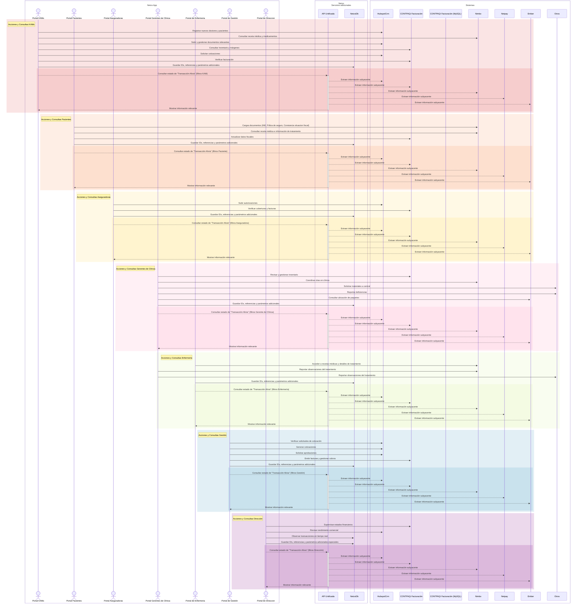
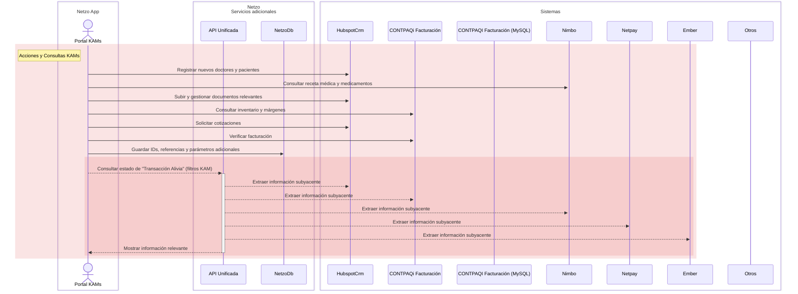
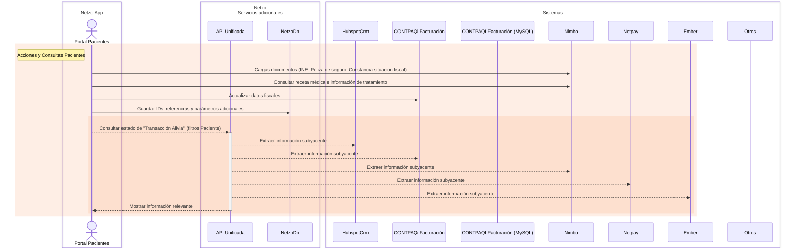
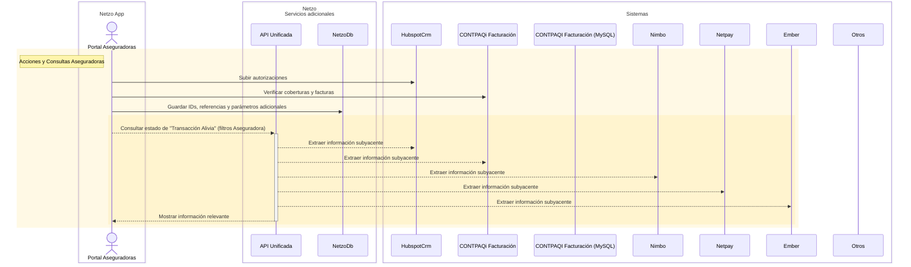
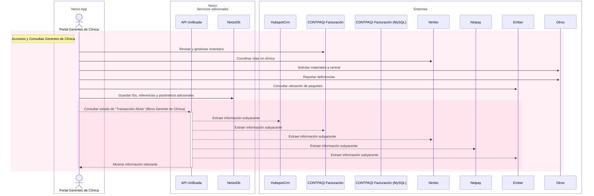
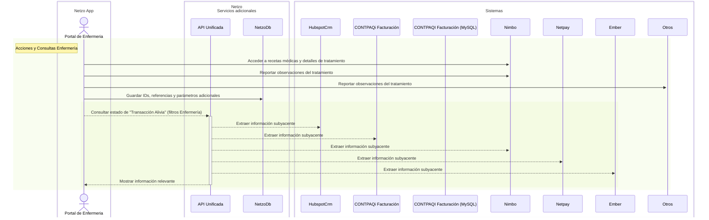
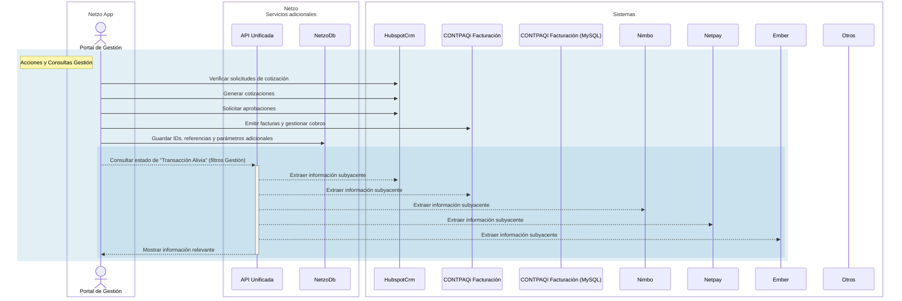
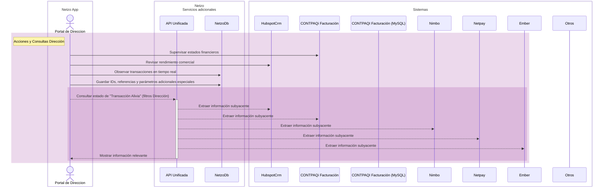

<h1>Propuesta de Colaboración con   Alivia Clinicas de Alta Especialidad</h1>
Confidencial 
Fecha: 2024-02-12

## Carta de presentación

Estimados,

gracias por su tiempo y consideración de nuestra propuesta de colaboración. En
Netzo, estamos entusiasmados con la posibilidad de trabajar con Alivia y
ayudarles a optimizar sus operaciones, mejorar la experiencia de sus pacientes y
ayudar en su crecimiento sostenible con nuestras tecnologías.

Nuestra propuesta se centra en la integración de sistemas existentes, la
centralización de datos y el desarrollo de aplicaciones personalizadas para
abordar las necesidades específicas de los diferentes puntos de contacto y
"stakeholders" de Alivia.

Nuestras metodologías reducen la barrera de entrada para la adopción de
tecnología de punta, ayudando a Alivia a atender sus necesidades tecnológicas y
mantenerse a la vanguardia en el sector de la salud.

En esta propuesta, detallaremos la visión de nuestro proyecto con ustedes,
información sobre nuestras tecnologías y nuestro posible marco de colaboración
con ustedes. Esperamos que esta propuesta sea de su interés y estaremos
encantados de discutir los detalles en una reunión.

Atentamente,

Arturo Romero

## Tabla de contenido

- [Carta de presentación](#carta-de-presentación)
- [Tabla de contenido](#tabla-de-contenido)
- [1. Introducción](#1-introducción)
  - [Detalles de la compañía](#detalles-de-la-compañía)
  - [Nuestra misión](#nuestra-misión)
  - [Nuestro equipo](#nuestro-equipo)
  - [Información de la empresa](#información-de-la-empresa)
- [2. Evaluación de la situación](#2-evaluación-de-la-situación)
  - [Visión de Alivia](#visión-de-alivia)
  - [Situación actual](#situación-actual)
  - [Sistemas y plataformas clave](#sistemas-y-plataformas-clave)
  - [Pain points identificados](#pain-points-identificados)
  - [Problemas operativos](#problemas-operativos)
- [3. Propuesta de solución](#3-propuesta-de-solución)
  - [Visión general](#visión-general)
  - [Macro esquema "Transacción"](#macro-esquema-transacción)
  - [3.3 Tecnología de punta](#33-tecnología-de-punta)
  - [3.4 Objetivos](#34-objetivos)
  - [3.5 Analisis de la situación actual](#35-analisis-de-la-situación-actual)
    - [3.5.1 Identificación de los stakeholders](#351-identificación-de-los-stakeholders)
- [3.6 Resultados esperados](#36-resultados-esperados)
  - [3.6.1 Portal de Key-Account-Managers](#361-portal-de-key-account-managers)
  - [3.6.2 Portal de Pacientes](#362-portal-de-pacientes)
  - [3.6.3 Portal de Aseguradoras](#363-portal-de-aseguradoras)
  - [3.6.4 Portal de Gerencia de Clínicas](#364-portal-de-gerencia-de-clínicas)
  - [3.6.5 Portal de Enfermeria](#365-portal-de-enfermeria)
  - [3.6.6 Portal de Gestión](#366-portal-de-gestión)
  - [3.6.7 Portal de Direccion](#367-portal-de-direccion)
- [4. Fases del Proyecto](#4-fases-del-proyecto)
  - [4.1 Cronograma estimado](#41-cronograma-estimado)
    - [4.1.1 Fase 1](#411-fase-1)
    - [4.1.2 Fase 2](#412-fase-2)
    - [4.1.3 Fase 3](#413-fase-3)
    - [4.1.4 Fase 4](#414-fase-4)
  - [Detalles del Contrato](#detalles-del-contrato)
  - [Stakeholders clave en Alivia](#stakeholders-clave-en-alivia)

## 1. Introducción

### Detalles de la compañía

Netzo es una startup de tecnología especializada en el desarrollo de
aplicaciones empresariales internas. Nuestras metodologías reducen la barrera de
entrada para la adopción de tecnologías de punta, ayudando a nuestros clientes a
innovar y mantenerse a la vanguardia en sus sectores específicos, más rápido y
con menos recursos.

### Nuestra misión

Nuestra misión es ayudar a las empresas a mejorar sus operaciones, simplificando
el desarrollo de sistemas in-house a medida, y proporcionando herramientas para
la recopilación, almacenamiento, transferencia, transformación, visualización y
análisis de datos, en un solo lugar.

### Nuestro equipo

Nuestro equipo está compuesto por ingenieros de software y expertos en
transformación digital altamente calificados y egresados de las universidades
más prestigiosas de Alemania. Contamos con una amplia experiencia en
metodologías de desarrollo de software, en el desarrollo de aplicaciones
empresariales internas (tableros e interfaces) y en la integración de sistemas
complejos.

**Arturo Romero Karam**, CEO
<i>Maestria en Ingeniería Mecánica y Materiales, TU Dresden, Alemania</i>

**Miguel Romero Karam**, CTO
<i>Maestría en Ciencias Robóticas, Cognición e Inteligencia, TU Munich,
Alemania</i>

**Gabriel Romero Karam**, COO
<i>Maestria en Ingenieria Electrica y Ciencias de la Información, TU Munich,
Alemania</i>

### Información de la empresa

Nombre: Netzo (ROKAWARE SL) Direccion fiscal: Paseo de la Castellana 89, Planta
8va, 28046 Madrid, España Tax-ID (NIF): B09980772 | EU-VAT: ESB09980772 netzo.io
| hello@netzo.io | +34 613 037 756

## 2. Evaluación de la situación

### Visión de Alivia

Alivia, una clínica de salud líder en el mercado mexicano, tiene una visión
clara de su futuro digital, que incluye un centro de operaciones para la mejora
de la atención al paciente, su eficiencia operativa e introducción de nuevos
controles y modelos de negocio. Alivia busca:

1. Centrar sus operaciones alrededor del paciente
2. Lograr procesos comerciales más rápidos y eficientes
3. Obtener visibilidad sobre las transacciones y márgenes de ganancia de cada
   operación
4. Habilitar nuevos modelos de negocio, mediante la venta de datos estadísticos
   a laboratorios y aseguradoras
5. Incorporar tecnologías avanzadas, como IoT, para mejorar sus servicios y
   compromiso con el paciente

### Situación actual

- Desafíos operativos y de gestión de datos obstaculizan el crecimiento y la
  eficiencia de Alivia.
- Transformación en procesos comerciales con integración de CRM y sistema ERP
  para contabilidad y finanzas.
- Inversiones en tecnología para mejorar la experiencia del paciente y del
  personal, incluyendo reportes de business intelligence (PowerBI).
- Alianzas con proveedores de software para gestión de clínicas e incorporación
  de tecnología con médicos afiliados.
- Amplio equipo de alrededor de 300 personas, con centro de operaciones y
  distribución de medicamentos en CDMX y cerca de 20 clínicas de infusión a
  nivel nacional.
- Clínicas de infusión que utilizan tecnología para programación de citas y
  pagos con tarjeta de crédito (NetPay).
- Aliados estratégicos incluyen laboratorios farmacéuticos, aseguradoras,
  doctores afiliados, gerentes de clínica, key account managers, y otro personal
  administrativo.
- Distribución oficial de nueva tecnología de paquetería para entrega de
  medicamentos a clínicas de infusión.
- Retrasos en la toma de decisiones y ejecución de operaciones debido a falta de
  disponibilidad oportuna de información para stakeholders y dueños de procesos.

### Sistemas y plataformas clave

Los sistemas y plataformas clave utilizados actualmente por Alivia incluyen:

- **HubSpot CRM:** Sistema de gestión de relaciones con los clientes. Contiene
  información comercial del negocio o "transacción" de Alivia de forma
  semi-estructurada. Alivia ha hecho un gran esfuerzo para la captura de datos
  de sus pacientes, aseguradoras y doctores afiliados en este sistema y cuenta
  con algunos reportes de rendimiento de sus operaciones comerciales.

- **CONTPAQi:** Sistema de contabilidad y finanzas. Contiene la información
  financiera y de contabilidad de Alivia, así como la información de sus
  proveedores, clientes y productos en inventario. El sistema no cuenta con una
  API para la integración con otros sistemas.

- **Nimbo:** Sistema de gestión de clínicas. Contiene la información de los
  pacientes en las clínicas de doctores afiliados y da a los doctores la
  capacidad de programar citas y de facturar sus servicios. El sistema cuenta
  con una API, de donde se pueden obtener los datos de los pacientes,
  medicamentos recetados y tratamientos aplicados.

- **NetPay:** Plataforma de pagos con tarjeta. Contiene la información de los
  pagos de los tratamientos y medicamentos aplicados a los pacientes vía tarjeta
  de crédito. El sistema cuenta con una API para la integración con otros
  sistemas.

- **Ember:** _(Próximamente)_ Plataforma de monitoreo de paquetes
  auto-refrigerados y cadena de frío sin interrupciones. Contiene la información
  de la logística de entrega de los medicamentos y el estado de los medicamentos
  en tránsito. El sistema cuenta con una API para la integración con otros
  sistemas.

### Pain points identificados

Tras las conversaciones con el equipo de Alivia, hemos identificado los
siguientes pain points:

1. Proceso comercial de 7 días para la facturacion de servicios
2. Stakeholders sin posibilidad de interactuar con los sistemas y plataformas
   clave
3. Poca visibilidad en tiempo-real sobre las transacciones y margenes de
   ganancia de cada operación
4. Prescripción de productos con menor margen de ganancia y misma categoría
5. Logística de entrega de medicamentos con alto costo, poco control y baja
   visibilidad
6. Poca visibilidad sobre el rendimiento de los distintos stakeholders,
   aplicación de premios y/o sanciones

### Problemas operativos

Un diagnóstico inicial de los sistemas y plataformas clave de Alivia revela los
siguientes problemas operativos, que contribuyen directamente a los pain points
identificados:

- Falta de integración de todas las posibles fuentes de datos.
- Falta de sincronización entre sistemas y plataformas clave.
- Dificultad de extracción de datos de los sistemas y plataformas clave.
- Falta de esquemas de datos personalizados a Alivia para gestión de operaciones
  únicas.
- Falta de herramientas de captura de datos para los distintos stakeholders.
- Datos dispersos y subutilizados en los análisis de business intelligence.

## 3. Propuesta de solución

### Visión general

Nuestra propuesta se centra en abordar los problemas tecnológicos identificados
mediante:

1. Integración de todas las fuentes de datos existentes
2. Identificación de la información disponible y/o necesaria en cada punto de
   interacción
3. Desarrollo de un esquema de datos a medida de la operación de Alivia
4. Elaboración de un 'data lake' virtual para la centralización de datos
5. Elaboración de interfaces adecuadas para cada stakeholder

Como elemento central, proponemos la elaboración de un macro esquema de datos
personalizado a la operación de Alivia y de las actividades que cada
departamento tiene sobre este mismo.

A este esquema lo llamaremos: **"Transacción"**.

> La propuesta consiste, no solo en la tecnología necesaria, sino también en la
> implantación de la tecnología desarrollada por Netzo para la expansión del
> ecosistema digital de Alivia.

### Macro esquema <u>"Transacción"</u>

La propuesta de un macro esquema de datos personalizado para la operación de
Alivia, permitirá la identificación de los puntos de contacto de una operación,
desde su inicio hasta el fin, es decir el alta del paciente hasta la entrega de
los medicamentos en la clinica de infusion. Este esquema incluirá:

| Tipo de información            | Lugares, Personas o Sistemas Relevantes                                                                                                                                                                                                                                                                                                                                                                                                                                                                                                              |
| ------------------------------ | ---------------------------------------------------------------------------------------------------------------------------------------------------------------------------------------------------------------------------------------------------------------------------------------------------------------------------------------------------------------------------------------------------------------------------------------------------------------------------------------------------------------------------------------------------- |
| Documentos                     | - Identificación (INE)  - Póliza de seguros  - Recetas médicas  - Cotizaciones  - Comprobantes de pago  - Constancia de situación fiscal (CSF)  - Facturas                                                                                                                                                                                                                                                                                                                                                                         |
| Identificación de stakeholders | - Pacientes  - Aseguradoras y/o agentes  - Laboratorios  - Proveedores de paquetería  - Doctores afiliados  - Key-account managers  - Gerentes de clínica  - Personal de enfermería  - Gestoría (cotización, facturación)  - Dirección (aprobación y monitoreo)                                                                                                                                                                                                                                                           |
| Acciones a ejecutar            | - Dar seguimiento a doctores afiliados  - Aprobar o rechazar pacientes  - Aprobar o rechazar tratamientos  - Aprobar o rechazar cotizaciones  - Facturar servicios aplicados a los pacientes  - Programar citas  - Programar entregas de medicamentos                                                                                                                                                                                                                                                                              |
| Estado de la operaciones       | - Aprobado (por aseguradora, por gerente, por director)  - Rechazado (por aseguradora, por gerente, por director)  - En proceso  - Finalizado  - Programado  - Entregado                                                                                                                                                                                                                                                                                                                                                              |
| Información en sistemas        | **HubSpot CRM**  - Contactos (Pacientes, Doctores, KAMs, Agentes (Aseguradora), Proveedores (Laboratorios, Paqueteria))  - Actividades  - _Negocios_ (Cotización, Factura, Comprobante de pago, Receta, Documentos, etc)  **CONTPAQi**  - Facturas  - Productos  - Clientes  - Proveedores  **Nimbo**  - Pacientes  - Doctores  - Recetas (Medicamentos recetados)  **NetPay**  - Comprobantes de pago  **Ember**  - Estado de entregas  - Estado de medicamentos  - Ubicación de medicamentos |

> El macro esquema "Transacción" es similar al esquema definido en el CRM de
> HubSpot (Deals), o "Negocios", pero con la capacidad de mostrar información
> dinámica, proveniente de múltiples fuentes, para la operación de Alicia (No,
> solamente un folio o número identificador estático).

### 3.3 Tecnología de punta

Las tecnologías desarrolladas por Netzo, reducen la barrera de entrada a
tecnologías de la información avanzadas y proporcionan las herramientas, módulos
y funcionalidades necesarias, para la elaboración de sistemas de soporte
personalizados, más rápido y con menos recursos.

La tecnologías de Netzo proporciona las herramientas necesarias para la
recopilación, almacenamiento, transferencia, transformación, visualización y
análisis de datos, en un solo lugar.

Una incorporación modular al ecosistema digital de Alivia, permite la
optimización de los procesos de negocio, sin afectar las operaciones actual.

Entre las funcionalidades que se podrán desarrollar se encuentran:

✓ Sincronizaciones bidireccionales entre sistemas< ✓ Tableros e interfaces
operativas ✓ Funcionalidad complementaria para sistemas existentes ✓ Captura,
extracción y transformación de datos y automatización de flujos ✓ Integración de
sistemas y dispositivos IoT (GPS, control, etc) ✓ Desarrollo de aplicaciones
personalizadas

### 3.4 Objetivos

Los objetivos de la propuesta e integración de las tecnología de Netzo con
Alivia son:

1. Reducir del ciclo comercial de actualmente 7 dias al minimo (max 2 dias) →
   70% o más de reduccion
2. Dar visibilidad sobre las transacciones y su estado en tiempo-real a los
   distintos stakeholders
3. Medir márgenes de ganancia para tomar acciones necesarias
4. Disponibilidad de la información en tiempo-real a los distintos stakeholders

### 3.5 Analisis de la situación actual

#### 3.5.1 Identificación de los stakeholders

Los stakeholders de Alivia son grupos de personas o entidades que tienen
intereses o responsabilidades sobre partes del servicio integral de Alivia.

Algunos de los stakeholders identificados son:

| Stakeholder               | Funciones y Responsabilidades                                                                                                                                                                                                                                                                               |
| ------------------------- | ----------------------------------------------------------------------------------------------------------------------------------------------------------------------------------------------------------------------------------------------------------------------------------------------------------- |
| Pacientes                 | - Requieren atención rápida y de calidad.   - Necesitan intercambiar documentos como pólizas de seguros y recetas médicas.   - Programar citas y pagar servicios.   - Deben recibir notificaciones sobre la aprobación de tratamientos y comunicaciones importantes con Alivia y sus aseguradoras. |
| Aseguradoras y/o agentes  | - Autorizan tratamientos y medicamentos para los asegurados.   - Necesitan información como pólizas de pacientes y recetas médicas para procesar pagos.                                                                                                                                                  |
| Laboratorios              | - Proveen medicamentos biológicos.   - Requieren información para la compra y logística de entrega de medicamentos a las clínicas de infusión.                                                                                                                                                           |
| Proveedores de paquetería | - Manejan la logística de entrega de medicamentos a las clínicas de infusión, desde laboratorios hasta la entrega final.                                                                                                                                                                                    |
| Doctores afiliados        | - Prescriben tratamientos y medicamentos.   - Necesitan información para decisiones informadas sobre tratamientos y medicamentos.                                                                                                                                                                        |
| Key-account managers      | - Gestionan la relación con los doctores afiliados, afiliaciones, retención y generación de negocios.                                                                                                                                                                                                       |
| Gerentes de clínica       | - Supervisan la operación de la clínica, asegurando una atención eficiente y segura para los pacientes.                                                                                                                                                                                                     |
| Enfermería                | - Aplica tratamientos y medicamentos, requieren información precisa para su trabajo.                                                                                                                                                                                                                        |
| Gestoría                  | - Cotiza, aprueba y factura tratamientos y medicamentos, según las solicitudes de los Key-account managers.                                                                                                                                                                                                 |
| Dirección                 | - Aprueba o rechaza tratamientos, interviene en casos especiales y monitorea el rendimiento de los stakeholders.                                                                                                                                                                                            |

## 3.6 Resultados esperados

La implementación de la tecnología de Netzo en Alivia, permitirá operar sobre un
conjunto de datos unificado, que permitirá la toma de decisiones informadas y la
ejecución de operaciones en tiempo-real, para la mejora de la atención al
paciente, la eficiencia operativa y la introducción de nuevos controles y
modelos de negocio.

A su vez, la definición de las tareas y responsabilidades específicas de cada
stakeholder, permitirá la identificación de las necesidades de información y la
elaboración de interfaces adecuadas para cada uno. Adicionalmente, se podrán
desarrollar herramientas de automatización, sincronización y extracción según
necesidades adicionales.

Un esquema del concepto global de la solución, puede ser visualizado en el
siguiente diagrama. Este muestra una serie de herramientas y sistemas que se
encuentran en el ecosistema digital de Alivia, y como estos se relacionan entre
sí y con el macro esquema "Transacción", almacenado en la base de datos de union
"NetzoDb".

### 3.6.1 Portal de Key-Account-Managers

Detalle esquematico de las acciones y consultas que se realizan en el portal de
Key-Account-Managers de Alivia, y como estas se relacionan con los sistemas y
plataformas clave de Alivia.

> Las acciones y consultas definitivas se definirán en la etapa de desarrollo de
> cada app.

### 3.6.2 Portal de Pacientes

Detalle esquemático de las acciones y consultas que se realizan en el portal de
Pacientes de Alivia, y como estas se relacionan con los sistemas y plataformas
clave de Alivia.

> Las acciones y consultas definitivas se definirán en la etapa de desarrollo de
> cada app.

### 3.6.3 Portal de Aseguradoras

Detalle esquemático de las acciones y consultas que se realizan en el portal de
Aseguradoras de Alivia, y como estas se relacionan con los sistemas y
plataformas clave de Alivia.

> Las acciones y consultas definitivas se definirán en la etapa de desarrollo de
> cada app.

### 3.6.4 Portal de Gerencia de Clínicas

Detalle esquemático de las acciones y consultas que se realizan en el portal de
Gerentes de Clínica de Alivia, y como estas se relacionan con los sistemas y
plataformas clave de Alivia.

> Las acciones y consultas definitivas se definirán en la etapa de desarrollo de
> cada app.

### 3.6.5 Portal de Enfermeria

Detalle esquemático de las acciones y consultas que se realizan en el portal de
Enfermería de Alivia, y como estas se relacionan con los sistemas y plataformas
clave de Alivia.

> Las acciones y consultas definitivas se definirán en la etapa de desarrollo de
> cada app.

### 3.6.6 Portal de Gestión

Detalle esquemático de las acciones y consultas que se realizan en el portal de
Gestión de Alivia, y como estas se relacionan con los sistemas y plataformas
clave de Alivia.

> Las acciones y consultas definitivas se definirán en la etapa de desarrollo de
> cada app.

### 3.6.7 Portal de Direccion

Detalle esquemático de las acciones y consultas que se realizan en el portal de
Dirección de Alivia, y como estas se relacionan con los sistemas y plataformas
clave de Alivia.

## 4. Fases del Proyecto

El proyecto se llevará a cabo en tres fases principales, cada una con sus
propios objetivos, entregables y cronograma. Las fases se describen a
continuación.

- **Fase 1:** Integración de sistemas clave, exploración de capacidades y datos
- **Fase 2:** Desarrollo de aplicaciones y capacidades básicas (exploración y
  retroalimentación)
- **Fase 3:** Definición de alcance y capacidades avanzadas
- **Fase 4:** Desarrollo de capacidades avanzadas según definición de alcance
- **Fase 5:** Implementación y entrega final
- **Adicional:** Iteraciones y mejoras de cada fase, no contempladas en el
  alcance inicial

### 4.1 Cronograma estimado

El cronograma de implementación del proyecto se detalla a continuación.

#### 4.1.1 Fase 1

> Integración de sistemas clave, exploración de capacidades y datos

- **Duración estimada:** 4 semanas
- **Objetivos:**
  - Integración de sistemas clave y plataformas de pago
  - Exploración de capacidades y limitaciones de los sistemas clave
  - Identificación de recursos a integrar entre los sistemas clave
  - Elaboración preliminar de macro esquema de transacción
  - Interfaces de exploración de datos entre sistemas clave
- **Factores críticos de éxito:**
  - Soporte y colaboración a tiempo por los equipos de Alivia
  - Generación de claves de API y acceso a sistemas clave
  - Compra de licencias de terceros para acceso a sistemas clave
  - Licencia Netzo

#### 4.1.2 Fase 2

> Desarrollo de aplicaciones y capacidades básicas (preliminares)

Nota: Estos desarrollos permitirán visualizar y dar retroalimentación sobre las
capacidades básicas que obtendrán los usuarios finales. Su funcionamiento será
limitado y su alcance será definido para cada aplicación en particular, según
las necesidades de los usuarios finales y los sistemas clave a incorporar.

- **Duración estimada:** 2 semanas/ herramienta
- **Objetivos:**
  - Desarrollo de aplicaciones y capacidades básicas para exploración y
    retroalimentación
  - Definición de los objetivos y alcances de cada aplicación
  - Definición de interfaces y capacidades básicas para su funcionamiento
  - Definición de los recursos a integrar entre los sistemas clave
  - Configuracion de modulos Netzo (autenticación, encabezados, layouts, etc.)
  - Aplicación preliminar desarrollada (según definición de alcance básica)
- **Factores críticos de éxito:**
  - Sistemas previamente integrados y funcionales
  - información disponible y "limpia" para uso
  - Capacidades básicas limitadas a "solo-lectura"
  - Componentes visuales, limitados a tablas y gráficos simples

#### 4.1.3 Fase 3

> Definición de alcance y capacidades avanzadas

- **Duración estimada:** 3 semanas / herramienta
- **Objetivos:**
  - Revisión y retroalimentación de aplicaciones y capacidades básicas
  - Exploración de las necesidades detalladas de los usuarios finales
  - Definición de capacidades de lectura y escritura
  - Elaboración de alcance y objetivos definitivos
  - Autorización de alcance y objetivos
- **Factores críticos de éxito:**
  - Retroalimentación de los usuarios finales
  - Definición de alcance y objetivos claros
  - Autorización de alcance y objetivos por parte de Alivia

#### 4.1.4 Fase 4

> Desarrollo de capacidades avanzadas según definición de alcance

- **Duración estimada:** 4 semanas / herramienta
- **Objetivos:**
  - Desarrollo de aplicaciones y capacidades avanzadas según definición de
    alcance
  - Documentación de desarrollo
  - Aplicación desarrollada y funcional (según definición de alcance avanzada)
- **Factores críticos de éxito:**
  - Desarrollo de aplicaciones y capacidades avanzadas
  - Colaboración y soporte continuo por parte de Alivia

### Detalles del Contrato

- Duración: 12 meses, renovación anual
- Precio: Plan Enterprise a 2,200 USD mensuales, incluyendo:
  - Todos los recursos del plan Business, que incluye:

    - 10 aplicaciones publicadas
    - 8 asientos de plataforma
    - 100 usuarios de aplicaciones
    - 5 GB de almacenamiento de datos
    - 1 dominio personalizado
    - Eliminar la marca de Netzo
    - Retención de registro de 28 días
    - Registro de auditoría
    - Soporte y servicios
    - Soporte por correo electrónico

    Costos adicionales:
    - Servicios profesionales: 150 USD + IVA por hora adicional.
    - Gestión de código: 100 USD adicionales por proyecto.
    - Asientos adicionales: 45 USD + IVA por asiento adicional.
    - Usuarios de aplicaciones adicionales: 1 USD + IVA por usuario adicional.
    - Almacenamiento de datos adicional: 25 USD + IVA por GB adicional.
    - Solicitudes mensuales adicionales: 0.0004 USD + IVA por solicitud
      adicional.

  - 4 horas mensuales de soporte profesional.
  - 16 horas adicionales mensuales durante los primeros 2 meses para
    integraciones y desarrollo de interfaces.

### Stakeholders clave en Alivia

Dirección general:

- **Sr. Hector Benavides,** CEO

Dirección de operaciones y logística:

- **Sr. Federico Benavides,** COO
- **Sr. Luis Saldivar,** Director de operaciones
- **Sr. Hugo Mier,** Manager de operaciones

Dirección financiera:

- **Sr. Christian Burgos,**, Planeación y finanzas
